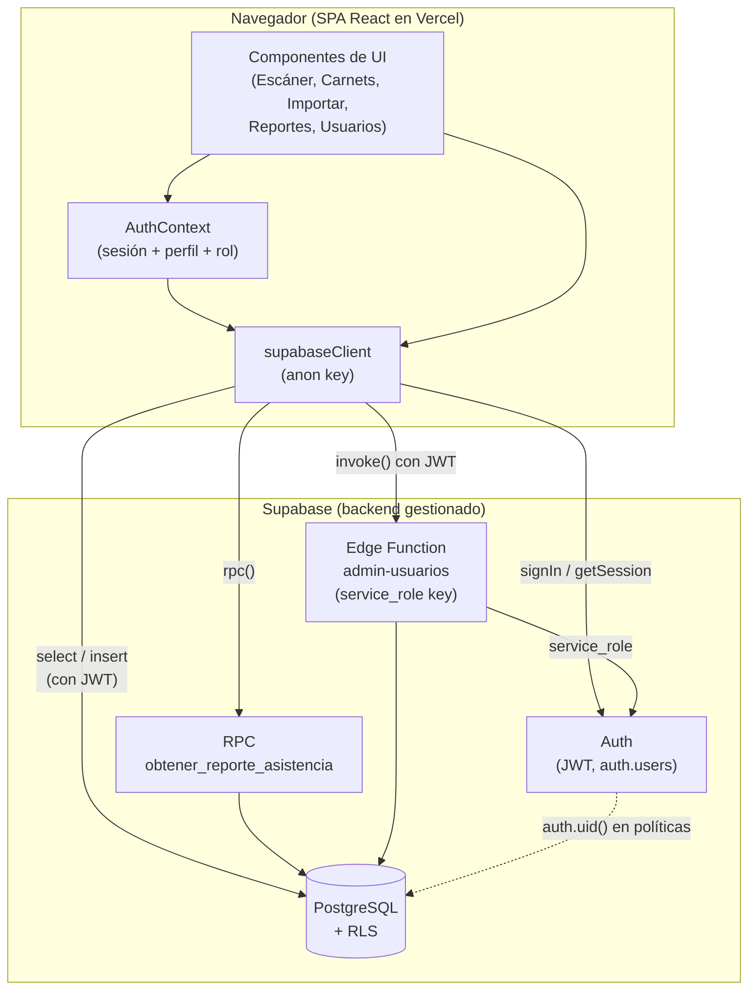
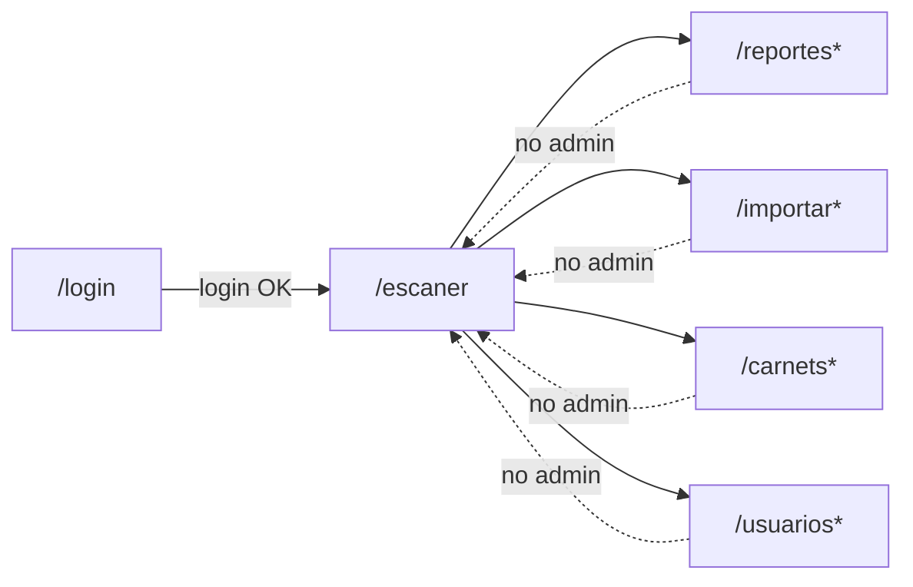
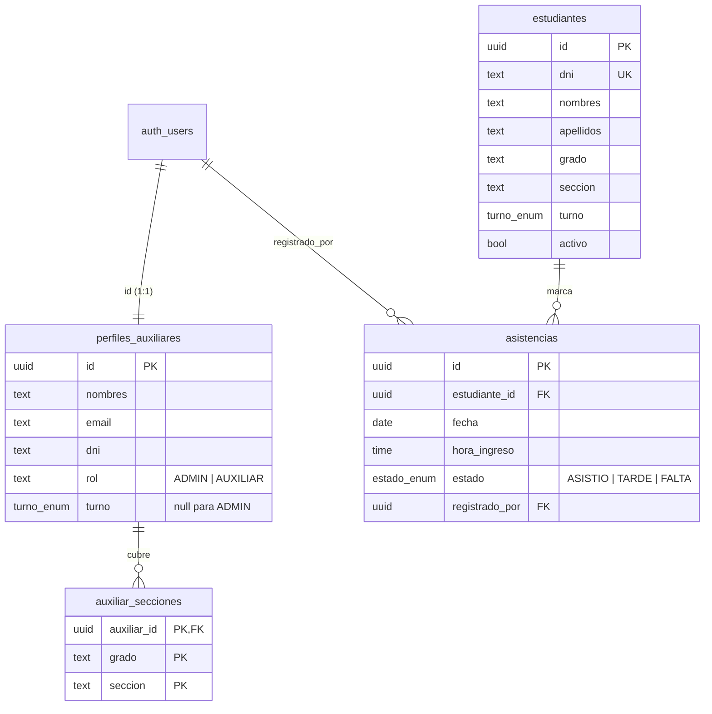
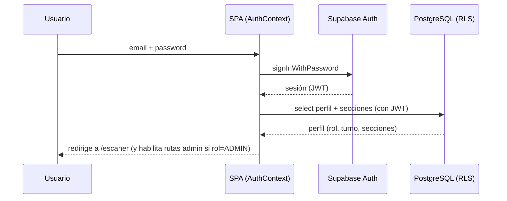
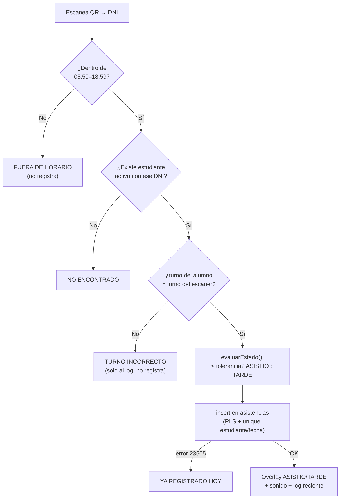
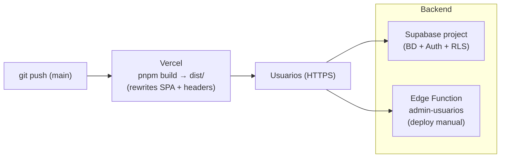

# Arquitectura — Sistema de Asistencia QR (Colegio San Juan)

Documento de referencia técnica para entender, mantener y **replicar** el
sistema. Describe cómo están organizadas las piezas (frontend, base de datos,
seguridad y despliegue), los flujos principales y las reglas de negocio.

> Para la puesta en marcha paso a paso, ver `README.md`.
> Para el detalle de endurecimiento de seguridad, ver `SEGURIDAD.md`.

---

## 1. Visión general

Aplicación web (SPA) para el **control de asistencia escolar mediante códigos
QR**, con dos turnos (Mañana / Tarde), reglas de tolerancia por horario,
jurisdicción por auxiliar y reportes de tardanzas.

- **Cada estudiante** tiene un carnet con un QR que codifica su DNI/código.
- **El auxiliar** en la puerta escanea el QR con la cámara; el sistema decide en
  el momento si la marcación es **PUNTUAL (ASISTIÓ)**, **TARDE** o si el
  estudiante llegó en el **turno incorrecto**.
- **El administrador** importa la nómina desde Excel, genera los carnets, gestiona
  usuarios (auxiliares) y consulta los reportes.

### Stack

| Capa        | Tecnología                                                             |
|-------------|------------------------------------------------------------------------|
| Frontend    | React 18 + Vite 5 + React Router 6 + Tailwind CSS 3                     |
| Backend     | Supabase → PostgreSQL, Auth (JWT), Row Level Security (RLS), Edge Fns   |
| QR          | `qrcode.react` (generación) · `html5-qrcode` (escaneo con cámara)      |
| Excel       | `xlsx` (importación de nómina y exportación de reportes)               |
| Hosting     | Vercel (frontend estático) + Supabase (backend gestionado)             |
| Gestor pkgs | pnpm                                                                    |

No hay servidor propio de aplicación: **el frontend habla directamente con
Supabase**. La única lógica "de servidor" propia es una Edge Function para tareas
que requieren privilegios elevados (crear/eliminar usuarios de `auth.users`).

---

## 2. Diagrama de alto nivel



**Idea clave de seguridad:** el navegador solo usa la **anon key**. Toda la
autorización vive en la base de datos vía **RLS** (`auth.uid()` identifica al
usuario en cada consulta). La **service_role key** (que salta RLS) jamás llega al
cliente: solo existe dentro de la Edge Function.

---

## 3. Frontend

### 3.1 Puntos de entrada y proveedores

`src/main.jsx` monta el árbol de proveedores globales:

```
<BrowserRouter>
  <AuthProvider>      → sesión, perfil, rol, login/logout
    <UIProvider>      → toasts / notificaciones
      <App />         → enrutado
```

### 3.2 Enrutado y protección de rutas (`src/App.jsx`)

- `/login` — pública. Si ya hay sesión, redirige a `/escaner`.
- Área protegida bajo `ShellLayout` (renderiza `Shell` una sola vez con
  `<Outlet/>` dentro, para que la barra lateral no "parpadee" al navegar):
  - `/escaner` — **todos** los usuarios autenticados (auxiliar y admin).
  - `/reportes`, `/importar`, `/carnets`, `/usuarios` — **solo ADMIN**
    (envueltas en `<RutaAdmin>`; un auxiliar es redirigido a `/escaner`).
- `*` — cualquier otra ruta redirige a `/escaner`.


`*` = ruta solo-admin (guard `RutaAdmin`).

### 3.3 Estado global: `AuthContext` (`src/lib/AuthContext.jsx`)

- Escucha `supabase.auth.onAuthStateChange` y `getSession`.
- Al haber sesión, carga el **perfil** desde `perfiles_auxiliares` junto con sus
  `auxiliar_secciones` (grado + sección a cargo).
- Expone: `session`, `perfil`, `esAdmin` (`perfil.rol === 'ADMIN'`), `cargando`,
  `iniciarSesion`, `cerrarSesion`, `recargarPerfil`.
- Optimización: usa `usuarioIdRef` para **no recargar el perfil** en cada
  reautenticación (Supabase reemite `SIGNED_IN` al reenfocar la pestaña); así no
  se desmontan pantallas ni se pierden formularios en curso.

### 3.4 Componentes (`src/components/`)

| Componente          | Rol         | Responsabilidad                                                                 |
|---------------------|-------------|---------------------------------------------------------------------------------|
| `EscanerQR`         | todos       | Cámara + overlay a pantalla completa; evalúa y registra la marcación.           |
| `CarnetsQR`         | admin       | Genera carnets con QR; filtra por turno/grado-sección; exporta a PDF/PNG.        |
| `ImportarExcel`     | admin       | Sube la nómina; detecta columnas por alias; asigna turno según la sección.      |
| `EditarAlumno`      | admin       | Alta/edición puntual de un estudiante.                                           |
| `ReportesAuxiliar`  | admin       | KPIs, ranking de tardanzas, filtros y exportación a Excel (vía RPC).            |
| `GestionUsuarios`   | admin       | Alta/baja/edición de auxiliares y admins (vía Edge Function).                    |
| `Shell`             | —           | Layout: barra lateral / navegación inferior móvil.                              |
| `ProfileMenu`       | —           | Menú de usuario (cerrar sesión, etc.).                                           |
| `Icon`, `Cargador`  | —           | Utilitarios de UI (íconos, spinner).                                             |

### 3.5 Reglas de negocio compartidas (`src/utils/turnos.js`)

Única fuente de verdad del dominio horario. Funciones clave:

- `HORARIOS` — secciones, hora de ingreso, **tolerancia** y salida por turno.
- `seccionATurno(seccion)` — A–E → Mañana, F–H → Tarde.
- `evaluarEstado(turno, hora)` — `ASISTIO` si llega ≤ tolerancia, si no `TARDE`.
- `ventanaEscaneo(fecha)` — compuerta global: fuera de `05:59`–`18:59` el escaneo
  no cuenta (`ANTES` / `DESPUES` / `OK`).
- `gradoNumero` / `normalizarGrado` / `gradoCorto` — normalizan el grado, que puede
  venir del Excel como "3ro secundaria", "3°", "3RO"… para poder compararlo y
  mostrarlo de forma consistente.
- `fechaLocalISO` — fecha `YYYY-MM-DD` en hora **local** (evita el desfase UTC-5
  que adelantaría un día en marcaciones nocturnas).

> **Regla:** cualquier cambio de horario/tolerancia se hace **solo aquí** (y en el
> trigger SQL espejo, ver §4.2), no disperso por los componentes.

---

## 4. Backend (Supabase / PostgreSQL)

Todo el esquema vive en `sql/`. Instalación nueva: `sql/schema.sql`. Migraciones
y utilidades: el resto de scripts (ver `README.md`).

### 4.1 Modelo de datos



- **ENUMs:** `turno_enum(MANANA, TARDE)`, `estado_asistencia_enum(ASISTIO, TARDE, FALTA)`.
- **Unicidad clave:** `asistencias UNIQUE (estudiante_id, fecha)` → **una marcación
  por estudiante por día** (choque de doble escaneo devuelve error `23505`, que el
  escáner traduce a "YA REGISTRADO HOY").
- **Índices:** por `dni` y por jurisdicción (`turno, grado, seccion`) en
  estudiantes; por `fecha` y `estudiante` en asistencias.

### 4.2 Integridad: trigger de turno ↔ sección

`trg_validar_turno_seccion` (función `validar_turno_seccion`) valida, en cada
insert/update de `auxiliar_secciones`, que la sección (A–H) sea coherente con el
turno del auxiliar, y normaliza la sección a mayúsculas. **Es el espejo en la BD
de la regla `seccionATurno` del frontend.**

### 4.3 Funciones de apoyo (`SECURITY DEFINER`)

Evalúan al usuario autenticado sin caer en recursión de RLS:

- `es_admin()` — ¿el usuario actual tiene rol ADMIN?
- `turno_actual()` — turno del usuario actual (null para admin).
- `tiene_acceso(grado, seccion)` — ¿el usuario tiene esa combinación asignada?
  Compara el grado **por su número** (1–5), porque la jurisdicción se guarda como
  `3°`/`4°` pero el grado del estudiante llega del Excel como `3ro secundaria`.

### 4.4 Row Level Security (RLS)

RLS activo en las 4 tablas. Resumen del modelo de acceso:

| Tabla                 | ADMIN         | AUXILIAR                                              |
|-----------------------|---------------|------------------------------------------------------|
| `perfiles_auxiliares` | ve/gestiona   | ve solo su propio perfil                             |
| `auxiliar_secciones`  | ve/gestiona   | ve solo sus secciones                               |
| `estudiantes`         | ve/gestiona   | **solo lee** su jurisdicción (su turno + secciones) |
| `asistencias`         | ve/gestiona   | lee su jurisdicción; **inserta** solo en ella, con `registrado_por = auth.uid()` |

Un auxiliar **no puede crear/editar estudiantes** ni ver datos fuera de su turno y
secciones, aunque manipule la petición: la política lo filtra en la BD.

### 4.5 RPC de reportes

`obtener_reporte_asistencia(fecha_inicio, fecha_fin, turno?, grado?, seccion?)`:

- `SECURITY INVOKER` → respeta RLS (un auxiliar nunca vería otra jurisdicción),
  y además **exige explícitamente `es_admin()`** (los reportes son solo de admin,
  reforzado por `sql/restringir_reportes_a_admin.sql`).
- Cuenta `ASISTIO`/`TARDE` contra marcaciones reales y calcula **`FALTA`** para
  cada **día hábil** (lun–vie) del rango sin marcación (`generate_series` +
  `left join`). Ordena por más tardanzas primero.

### 4.6 Edge Function `admin-usuarios` (`supabase/functions/admin-usuarios/`)

Único lugar que usa la **service_role key**. Deno. Acciones (`POST` con JSON):

- `crear` — crea el usuario en `auth.users` + su fila en `perfiles_auxiliares`
  (+ `auxiliar_secciones`). Si falla algún paso, hace *rollback* borrando el
  usuario recién creado.
- `eliminar` — borra la cuenta (no permite auto-eliminarse).
- `cambiar_password` — actualiza contraseña (mínimo 8 caracteres).

Antes de tocar `auth.users`, **valida con el JWT de quien llama** que su perfil sea
`ADMIN`. CORS restringido por `ORIGENES_PERMITIDOS` + localhost + previews
`*.vercel.app`.

---

## 5. Flujos principales

### 5.1 Autenticación



### 5.2 Marcación por escaneo (`EscanerQR`)



Detalles: la cámara se pausa mientras se muestra el overlay (2.5 s) para no
re-leer el mismo QR; el audio se desbloquea al iniciar la cámara (gesto del
usuario). El turno del escáner queda fijado al turno del auxiliar (el admin puede
cambiarlo).

### 5.3 Importación de nómina (`ImportarExcel`)

1. Lee el `.xlsx` con `xlsx`.
2. **Detecta columnas por alias** (`DNI/DOCUMENTO/CÓDIGO`, `SECCIÓN/SEC`, …)
   normalizando cabeceras (sin acentos ni puntuación) → tolerante al formato real.
3. Deriva el **turno** con `seccionATurno` y normaliza el grado con
   `normalizarGrado`.
4. Previsualiza, valida y hace `upsert` en `estudiantes` (solo admin, por RLS).

### 5.4 Generación de carnets (`CarnetsQR`)

- Filtra por búsqueda, turno y grado/sección (las opciones se ordenan de 1ro a 5to
  y por sección, y se limitan al turno elegido).
- Renderiza el QR con `QRCodeSVG` (valor = DNI).
- **Exportar PDF:** arma un documento HTML aislado en un `iframe` oculto y llama a
  `print()` (el usuario elige "Guardar como PDF").
- **Descargar PNG:** dibuja el carnet completo en un `<canvas>` de alta resolución.

### 5.5 Reportes (`ReportesAuxiliar`)

Llama a la RPC `obtener_reporte_asistencia`, arma KPIs y ranking, y exporta a
Excel con `xlsx`. Restringido a admin en frontend (`RutaAdmin`) **y** en backend
(RLS + chequeo `es_admin()` en la función).

---

## 6. Reglas de horario

| Turno  | Secciones     | Ingreso puntual | Tolerancia (ASISTIÓ) | Tarde       | Salida |
|--------|---------------|-----------------|----------------------|-------------|--------|
| Mañana | A, B, C, D, E | 07:00           | hasta 07:10          | desde 07:11 | 12:45  |
| Tarde  | F, G, H       | 12:30           | hasta 12:45          | desde 12:46 | 18:15  |

Ventana global de escaneo: **05:59 – 18:59** (fuera de ella, el QR no cuenta).

> Definidas en `src/utils/turnos.js` (frontend) y reflejadas en el trigger SQL
> `validar_turno_seccion` (asignación de secciones). Mantener ambas en sincronía.

---

## 7. Seguridad (resumen)

- **Autorización en la BD (RLS)**, no en el cliente. El navegador solo tiene la
  anon key; la service_role key vive solo en la Edge Function.
- **Defensa en profundidad:** las rutas admin se protegen en el frontend
  (`RutaAdmin`) **y** en el backend (RLS + `es_admin()`).
- **Cabeceras HTTP** endurecidas en `vercel.json`: CSP estricta (solo `self` +
  Supabase para `connect-src`), HSTS, `X-Frame-Options: DENY`, `nosniff`,
  `Permissions-Policy` (cámara solo `self`), COOP, etc.
- **CORS** de la Edge Function restringido a orígenes permitidos.
- Detalle completo en `SEGURIDAD.md`.

---

## 8. Estructura de carpetas

```
src/
  components/   Módulos de UI (Escáner, Carnets, Importar, Reportes, Usuarios, Shell…)
  lib/          supabaseClient, AuthContext, UIContext
  pages/        Login
  utils/        turnos.js (reglas de dominio), sonidos.js
  index.css     Tailwind + ajustes al <video> de html5-qrcode
sql/            Esquema, migraciones y siembra (schema.sql = instalación nueva)
supabase/
  functions/
    admin-usuarios/   Edge Function (gestión de usuarios con service_role)
public/         Estáticos
vercel.json     Rewrites SPA + cabeceras de seguridad
vite.config.js  Build
```

---

## 9. Despliegue



- **Frontend:** Vercel (framework Vite; `installCommand`/`buildCommand` con pnpm;
  `outputDirectory: dist`; *rewrite* de todo a `/index.html` para el enrutado SPA).
- **Backend:** proyecto Supabase con los scripts de `sql/` aplicados. La Edge
  Function se despliega aparte (`supabase functions deploy admin-usuarios`).
- **Variables de entorno:** `VITE_SUPABASE_URL`, `VITE_SUPABASE_ANON_KEY` (build
  del frontend); `ORIGENES_PERMITIDOS` (Edge Function). La service_role key la
  inyecta Supabase en runtime.

---

## 10. Para replicar el sistema (checklist)

1. Crear proyecto Supabase; ejecutar `sql/schema.sql` y luego
   `sql/restringir_reportes_a_admin.sql`.
2. Crear el primer usuario en *Authentication → Users* y darlo de alta como ADMIN
   con `sql/alta_admin.sql`.
3. Desplegar la Edge Function `admin-usuarios` y configurar `ORIGENES_PERMITIDOS`.
4. Configurar `.env` (URL + anon key) y `pnpm dev` en local, o desplegar en Vercel
   con esas mismas variables.
5. Como admin: **Importar** la nómina (Excel) → **Generar** carnets → crear
   **auxiliares** con sus secciones. Los auxiliares ya pueden usar el **Escáner**.
```
